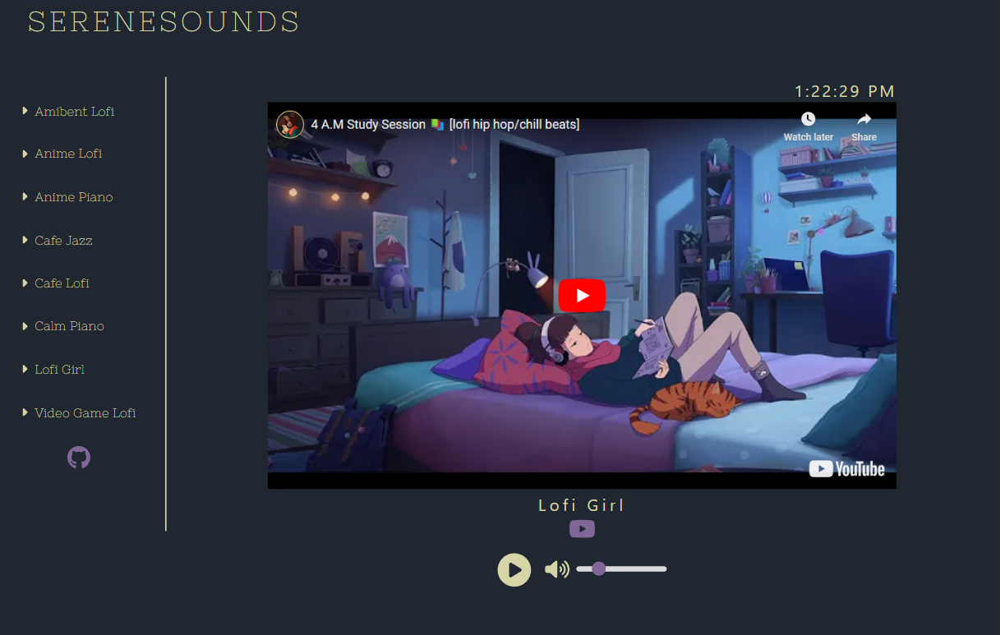
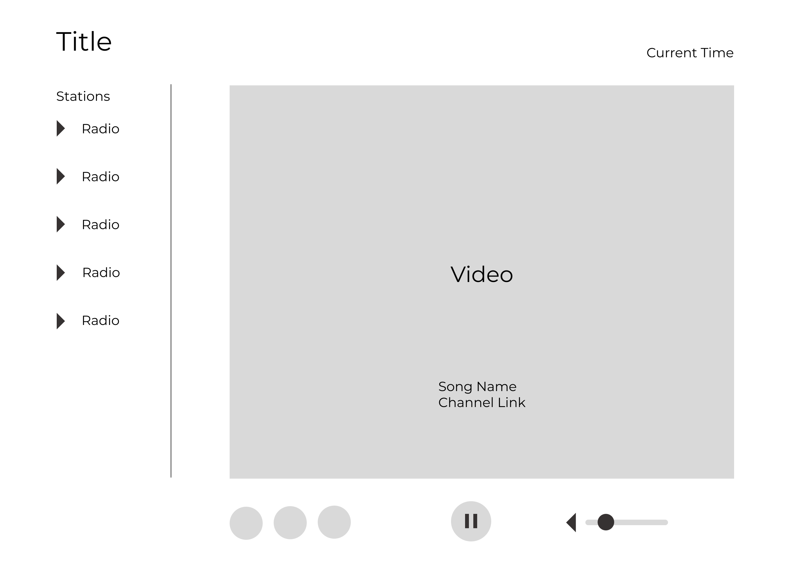
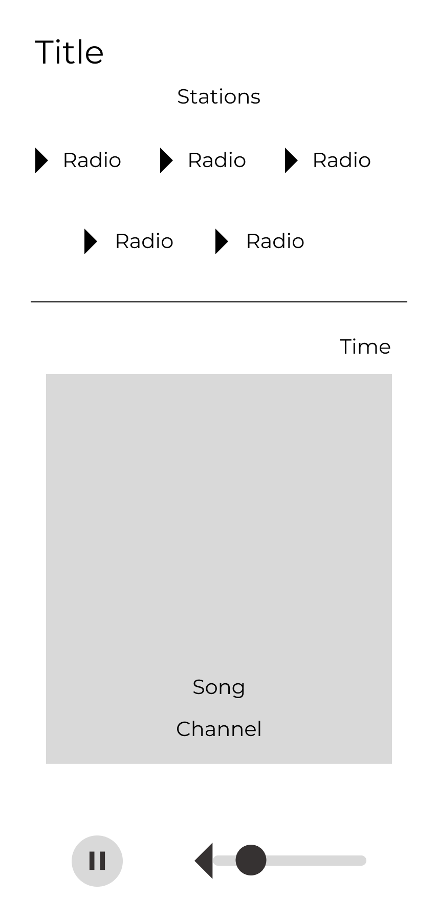

# SereneSounds - An Online Radio Player

## Overview

An application that allows you to play a variety of different music channels from Youtube.
The music channels featured are meant to be relaxing and played in the background of whatever
task you are doing.

## Preview [Live Site](https://serenesounds.vercel.app/)

## Mockups

I designed mockups for the application in [Figma](https://www.figma.com/file/2ydtjXvfeiLuFMss3slr3b/Music-Player-Design?type=design&node-id=15%3A40&mode=design&t=wui6GolxnKYSn5f8-1). While the application is intended for desktops, a mobile design of the application also exists.

## Features

- 8 unique music livestreams
- 100+ hours on music
- Functional custon play / pause buttons and audio controls
- Links to the Youtube channel of each station

## Tools

- [Vite (React)](https://vitejs.dev/)
- [Framer Motion](https://www.framer.com/motion/)
- [React Player](https://www.npmjs.com/package/react-player)
